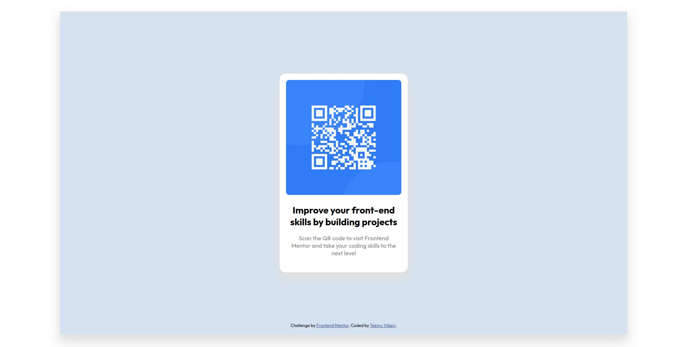

# Frontend Mentor - QR code component solution

This is a solution to the [QR code component challenge on Frontend Mentor](https://www.frontendmentor.io/challenges/qr-code-component-iux_sIO_H). Frontend Mentor challenges help you improve your coding skills by building realistic projects.

## Table of contents

- [Overview](#overview)
  - [Screenshot](#screenshot)
  - [Links](#links)
- [My process](#my-process)
  - [Built with](#built-with)
  - [What I learned](#what-i-learned)
  - [Continued development](#continued-development)
  - [Useful resources](#useful-resources)
- [Author](#author)

## Overview

### Screenshot



### Links

- Solution URL: [GitHub](https://github.com/paatre/qr-code-component-main)
- Live Site URL: [GitHub Pages](https://paatre.github.io/qr-code-component-main/)

## My process

### Built with

- Semantic HTML5 markup
- CSS custom properties
- Flexbox
- Mobile-first, responsive design

### What I learned

1. For some reason, I hadn't previously understood how `position: absolute` works together with `position: relative`. Now it clicked for me that absolutely positioned elemens aren't always absolutely positioned to `body` element! Nearest relatively positioned element is set up as a parent element for absolutely positioned child in any nested level. Cool!

2. A couple of weeks ago, I learned that [mathematical comparison operators for media queries were shipped out in Chrome 104](https://developer.chrome.com/blog/new-in-chrome-104/#mq-math). I wanted to test them out in this project for the first time. In my opinion, they feel a loot nicer to use than i.e. `max-width` and `min-width`! I'll use them in future projects as well.

```css
@media (width > 576px) {
    body {
        padding: 32px;
    }
}
```

3. Usually I like to use SCSS but for this project I just went with plain CSS. I noticed pretty soon how much I miss the nested syntax of SCSS. It makes reading style hierarchies SO much better. Not going to make the same mistake again dropping it. 😜

4. How to import Google Fonts with `@import`!

### Continued development

I want to make responsive design bread-and-butter for me. Need to work on that, absolutely.

### Useful resources

- [Box-shadow generator](https://developer.mozilla.org/en-US/docs/Web/CSS/CSS_Backgrounds_and_Borders/Box-shadow_generator) - This helped me to visually understand `box-shadow`. A really cool tool!

## Author

- GitHub - [@paatre](https://github.com/paatre/)
- Frontend Mentor - [@paatre](https://www.frontendmentor.io/profile/paatre)
- Twitter - [@teemuviikeri](https://twitter.com/TeemuViikeri)
